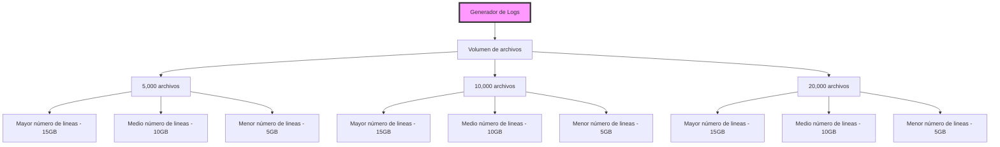

# Benchmark de Herramientas de Datos
> Realizado por: **Manuela Ramos Ospina**, **Paula Andrea Pirela Rios** y **Carlos Eduardo Baez Coronado**

Comparación de rendimiento entre Python Puro, Pandas, Polars, DuckDB y Spark para calcular tasas de códigos HTTP a partir de logs JSON almacenados en S3.

- El objetivo es medir tiempo de proceso, y contar el número de tasas de error 2xx, 4xx y 5xx.
- Los datos son logs sintéticos generados en S3.
- Escenarios de 5, 10, y 15 GB generados con 5mil, 10mil y 20mil JSON.
- Instancia: m5.2xlarge (Ubuntu 22.04).

## Estructura del Repositorio

```
mineria-benchmark/
│
├── common/                          # Utilidades compartidas
│
├── infrastructure/                   # Plantillas de infraestructura
│   ├── EC2/                         # Configuración de instancias EC2
│   │   ├── backend.tf               # Template del backend de Terraform
│   │   ├── main.tf                  # Recursos EC2, IAM, Security Groups
│   │   └── variables.tf             # Variables de configuración
│   └── S3/                          # Configuración de buckets S3
│       ├── backend.tf
│       └── main.tf
│
├── ex-python/                       # Experimento Python Puro
├── ex-pandas/                       # Experimento Pandas
├── ex-polars/                       # Experimento Polars
├── ex-duckdb/                       # Experimento DuckDB
├── ex-spark/                        # Experimento Apache Spark
│
├── results/                         # Logs de ejecución
│
├── run.sh                           # Script maestro de automatización
├── generator.ipynb                  # Notebook para generar datos sintéticos
├── pyproject.toml                   # Configuración del proyecto Python (uv)
└── README.md                        # Este archivo
```

**Componentes Importantes**

| Componente | Descripción |
|------------|-------------|
| `run.sh` | Orquesta todo: copia infraestructura, ejecuta Terraform, espera resultados, destruye recursos |
| `infrastructure/EC2/` | Template reutilizable para todos los experimentos |
| `ex-*/main.py` | Implementación específica de cada herramienta  |
| `ex-*/user_data.sh` | Script se ejecuta en la EC2 |

---
## Explicación base del Benchmark
### Generación de Datos
Los registros simulados son archivos JSON con la siguiente estructura:
```json
{
  "message":"HTTP Status Code: 500",
  "service":"evaluation",
  "timestamp":1.760218583963927E9
}
```
- Los datos se construyen de manera aleatoria —usando generadores— para producir combinaciones de servicios, tiempos y códigos que imitan el comportamiento de un sistema real de monitoreo. 
- Una vez generados, estos eventos se serializan como objetos JSON (uno por línea, en formato NDJSON) y se agrupan en múltiples archivos. 
- Jugamos con 3 volúmenes de archivos: 5, 10 y 20 mil archivos, cambiando el número de líneas por archivo para alcanzar los tamaños objetivo de 5, 10 y 15 GB respectivamente.
En la siguiente grafica se resumen los parámetros de generación:


### Implementación de Benchmarks
Cada herramienta de datos tiene su propio experimento en el directorio raíz:
- ex-python: Implementa map reduce con multiprocesamiento en Python puro.
- ex-pandas: Implementa map reduce con los archivos cargados en dataframes de Pandas.
- ex-polars: Implementado en Rust, con lazy evaluation y datos por particiones.
- ex-duckdb: Usa DuckDB para consultas SQL con ejecución vectorizada, evitando transferencias innecesarias entre python y el motor.
- ex-spark: Con arquitectura distribuida, usa Spark para procesamiento paralelo en memoria.

### Automatización del Backend de Terraform
El backend de terraform se automartiza para cada experimento en tres pasos:
1. Copia la plantilla maestra del backend `infrastructure/EC2/backend.tf` al directorio de infraestructura del experimento.
2. El script `run.sh` copia el `main.py` de cada experimento en un directorio en S3 único, limpia la infraestructura previa y crea un directorio fresco `infrastructure/` dentro del experimento.
De esta forma cada experimento mantiene su propio tfstate en S3.
3. El script `run.sh` inicializa terraform con el backend configurado para el experimento actual, espera la creación de los resultados en S3, los imprime en consola y destruye la infraestructura.

---
## Instrucciones para correr el benchmark

### 1) Conexión con AWS
Debes tener AWS CLI v2 y Session Manager Plugin instalados, paso seguido configurar:
- Solo una vez
```powershell
aws configure sso
# SSO session name
# SSO start URL
# SSO region
# Loggearse a la cuenta
# Profile name
```
- Después
```
aws sso login --profile maraosoc
```
> Para verificar el perfil ejecutar `aws sts get-caller-identity --profile maraosoc`

### 2) Configura tus variables
- En `backend.tf` (dentro de `infrastructure/EC2/`), actualiza los datos del bucket del tfstate.
- En `variables.tf` actualiza tu nombre de usuario y bucket S3 tfstate.
- En `run.sh` actualiza la ruta del S3 donde se almacenan los archivos JSON generados.

### 3) Inicializa el experimento
```bash
cd .\<ruta>\mineria-benchmark\
./run.sh <nombre experimento> <tamaño de datos en GB>
```
> ej: ./run.sh ex-pandas 5

Si estás en windows se lanzará _Git Bash_ o _WSL_ desde PowerShell donde se mostrará el log del experimento.

---
## Resultados
### En S3
En el bucket S3 configurado donde se almacenan los JSON, se crearán dos nuevas carpetas:
- `scripts` -> Contiene el `main.py` de cada experimento.
- `results` -> Contiene los logs de salida de cada experimento por tamaño de datos, con la estructura:
```log
Execution time: 39.533823 seconds
[('4', 56000426), ('2', 44803133), ('5', 11196441)]
```
Que indica el tiempo de ejecución y el conteo de códigos HTTP 2xx, 4xx y 5xx respectivamente.

A continuación una captura de pantalla de los resultados en S3:


### Analisis de resultados
Los logs de salida de los escenarios de 5, 10 y 20mil archivos con sus respectivos tamaños (5, 10 y 15 GB) se analizan en el notebook `analysis/benchmark_analysis.ipynb`, *demostrando que DuckDB y Polars son las herramientas más rápidas para este tipo de procesamiento de datos <- CAMMBIAR CUANDO SE TENGAN LOS RESULTADOS*.


